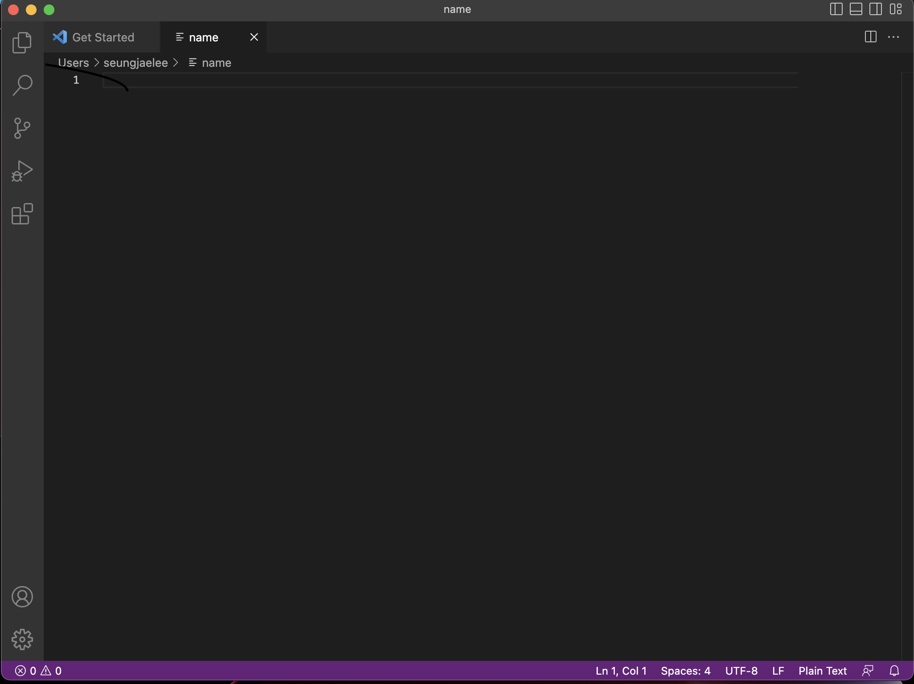
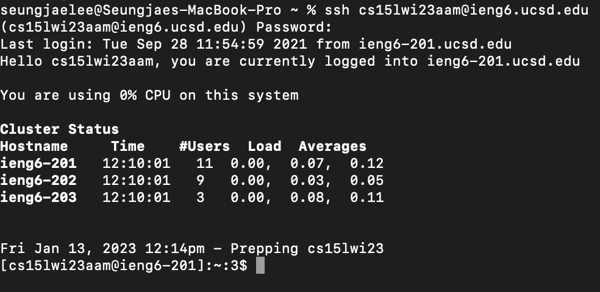
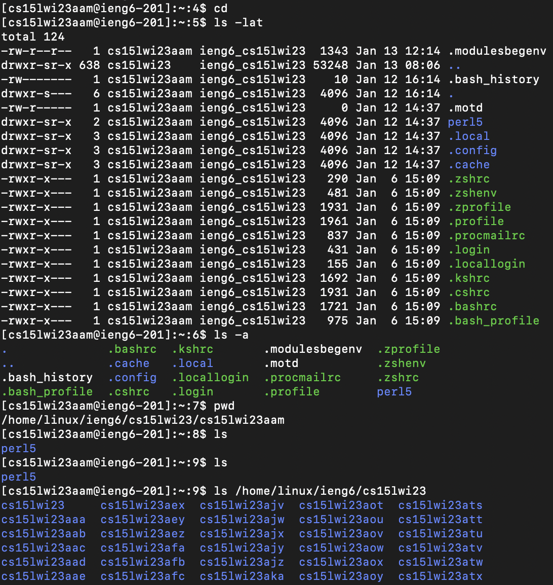

# Week 1 Lab Report
* Installing VS code
  * Opened Lab instruction page in the CSE 15L course website and then navigated to website to download the Visual Studio Code.
  * Used UCSD student account to download VS code for free for 6 months.

---

* Remotely Connecting
  * Tried to reset password of course-specific ieng6 account during lab session, but the password was not updated until the day after Lab session. 
 Therefore, moved on to the next step (Part 6) to create personal Github page instead of working Part 4 and 5.
  * Finally logged into ieng6 course account using ssh command in terminal on the next day.
  * Cluster Status was shown on the screen at first and then the system allow user to type some codes.
.

---

* Trying some commands
  * Tried cd, ls -lat, ls -a, pwd, ls, ls /home/linux/ieng6/cs15lwi23 commands.
   * The command "cd" is used to change current directory, it "cd .." directs to the parent directory of the current directory.
   * The command "pwd" prints the full path of the current directory.
   * The command "ls" lists the files and sub-directories in the current directory.
   * Hidden files and directories can also be listed with the commmand "ls -a".
   * The command "ls (directory)" lists the files and sub-directories in (directory).
   * The command "cp" allows us to copy the file (ex. txt file) from public or other directories.
   * The command "cat" prints out the content of the file     
  * Could see other course accounts in CSE 15 Lab submitting "ls -lat" command.
  * 
  * Figured out the current working directory by using pwd command line.

